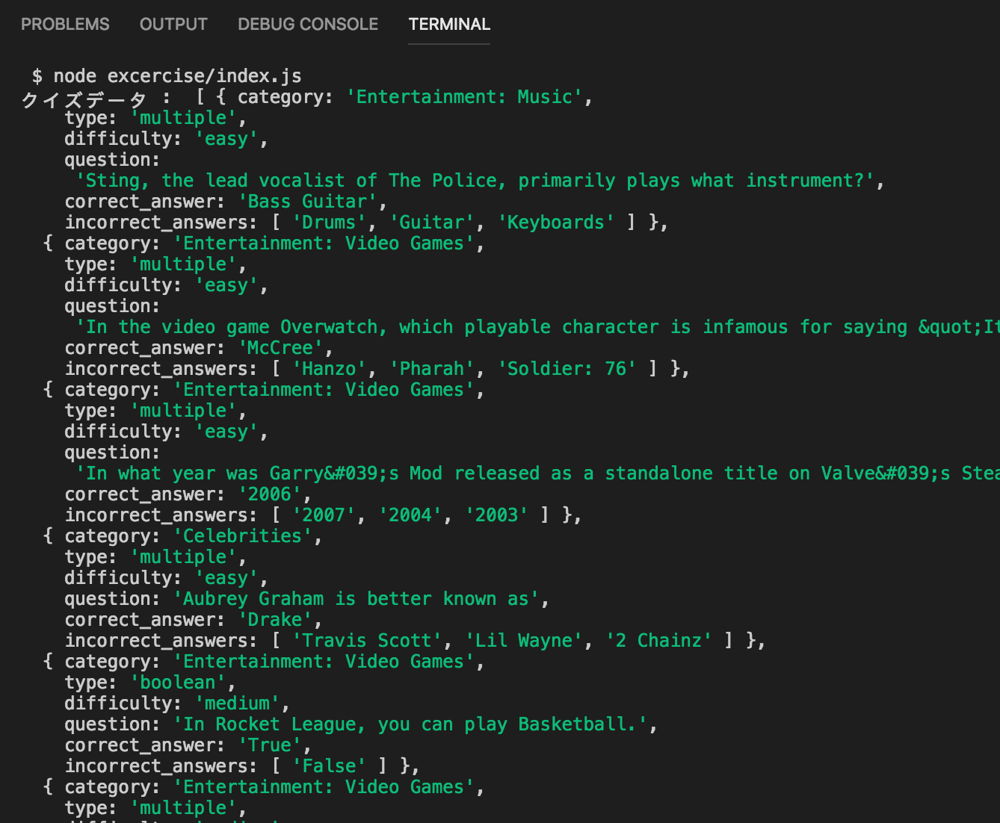

# レポジトリ内容

このレポジトリは[Web白熱教室](https://tsuyopon.xyz/)の[JavaScriptの学習コンテンツ > JavaScriptバックエンド編](https://tsuyopon.xyz/learning-contents/web-dev/javascript/backend/)にある「[【エクササイズ】fetchのライブラリでQuizデータを取得する](https://tsuyopon.xyz/learning-contents/web-dev/javascript/backend/js-excercise-for-backend-2/)」で利用するものです。

### 完成形

## 課題

- 以下の「課題をクリアするためのステップ」の内容を全て対応する
- 対応後、ターミナルでnodeコマンドを使ってindex.jsを実行したときに「完成形」と同じものが表示されるようにする

### 課題をクリアするためのステップ

1. [ ] package.jsonを作る
    - ヒント : npmコマンドを使って作成する
2. [ ] node_modulesをgitのバージョン管理から除外する
    - ヒント : .gitignoreを使う
3. [ ] excerciseディレクトリの中に次のファイルを作る
    - index.js
4. [ ] fetch用のライブラリとして「[axios](https://github.com/axios/axios)」をnpmでインストールする
    - excercise/package.jsonのdependenciesにaxiosが追加されるのを確認する
5. [ ] index.jsには次の機能を実装する
    - 4でインストールした「axios」を使って以下のURLからクイズデータを取得する
        - 利用するAPIのURL :  https://opentdb.com/api.php?amount=10
        - API提供サイト: https://opentdb.com/
        - axiosの使い方は[axiosのGitHubレポジトリ](https://github.com/axios/axios#example)を参照
    - 発展タスク: `async/await` を使って実装する
        - 参考:
            - [JavaScriptのasyncとawaitの概要【Promiseの発展系】](https://tsuyopon.xyz/learning-contents/web-dev/javascript/frontend/overview-of-async-and-await-in-js/)
            - [【JavaScript】asyncとawaitの使い方【サンプルコード付き】](https://tsuyopon.xyz/learning-contents/web-dev/javascript/frontend/how-to-use-async-and-await-in-js/)
            - [【JavaScript】async/awaitでの例外処理の方法](https://tsuyopon.xyz/learning-contents/web-dev/javascript/frontend/how-to-handle-exception-in-async-await/)
    - 「axios」を使って習得したクイズデータをconsole.logでターミナルに出力する

## 答え

- answersディレクトリ内に答えとなるファイルが格納されています
- answersディレクトリ内に「cd」コマンドを使って移動して、「node index.js」とやると答えの実行結果を確認することができます(**※確認するためには事前にaxiosをインストールする必要があります**)

## 参考記事

課題をこなしていて、行き詰まったら以下の資料を参考にしていただければ解答にたどり着けるかと思います。

- Web白熱教室
    - [【Node.JS】package.jsonを作る【npm init】](https://tsuyopon.xyz/learning-contents/web-dev/javascript/backend/how-to-create-a-package-json/)
    - [【Node.JS】npmを使ってライブラリをインストールする](https://tsuyopon.xyz/learning-contents/web-dev/javascript/backend/how-to-install-libraries-with-npm/)
    - [【Node.JS】npmでインストールしたライブラリを読み込む](https://tsuyopon.xyz/learning-contents/web-dev/javascript/backend/how-to-load-libraries-in-nodejs/)